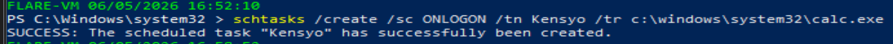
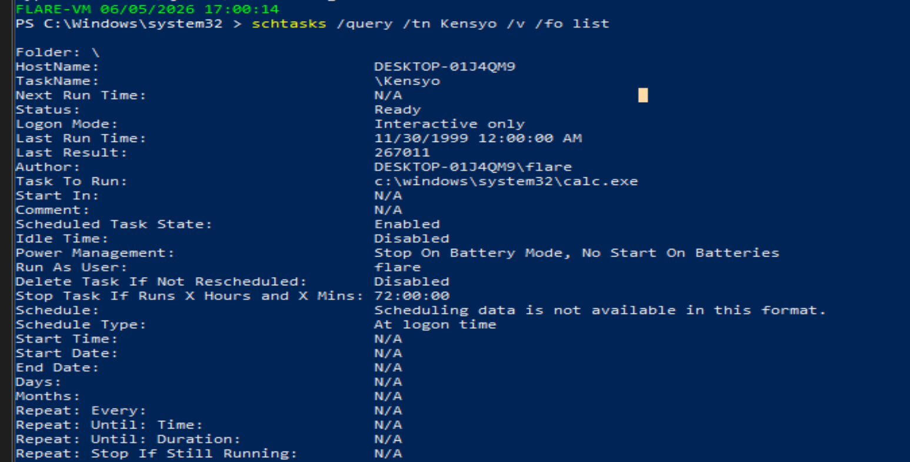
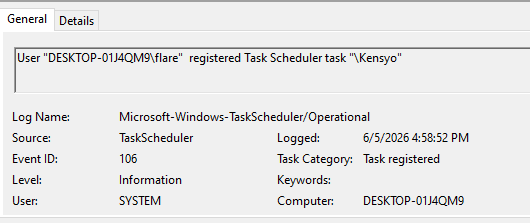
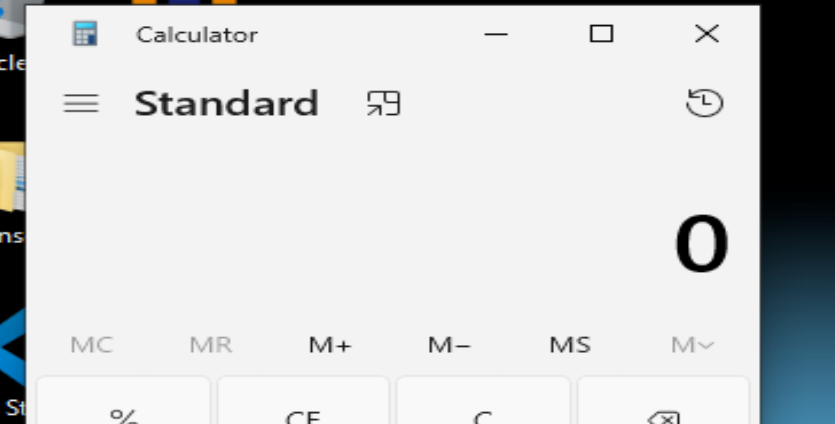
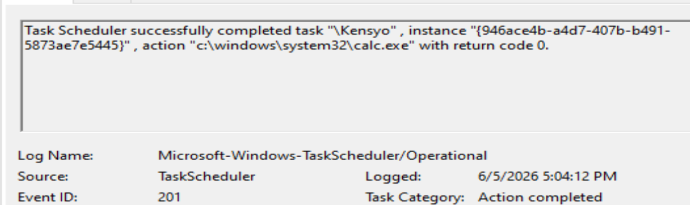

# Lab

## 目的
タスクの設定および、削除などの実行とログの確認。


## 前提
- Taskscheduler/operationalのログの有効化(管理者で)。
```powershell
$log = Get-WinEvent -ListLog Microsoft-Windows-TaskScheduler/Operational
$log.IsEnabled = $true
$log.SaveChanges()
```
- schtasks の構文
```powershell
schtasks /create /sc <scheduletype> /tn <taskname> /tr <taskrun> [/s <computer> [/u [<domain>\]<user> [/p <password>]]] [/ru {[<domain>\]<user> | system}] [/rp <password>] [/mo <modifier>] [/d <day>[,<day>...] | *] [/m <month>[,<month>...]] [/i <idletime>] [/st <starttime>] [/ri <interval>] [{/et <endtime> | /du <duration>} [/k]] [/sd <startdate>] [/ed <enddate>] [/it] [/np] [/z] [/xml <xmlfile>] [/v1] [/f] [/rl <level>] [/delay <delaytime>] [/hresult]
```
- lolbas-project から
        `schtasks /create /s targetmachine /tn "MyTask" /tr "cmd /c c:\windows\system32\calc.exe" /sc daily` でリモート端末にも作れるとのこと。
        

## 手順
1.タスクの作成/削除を複数の方法で試す(schtasks, set-scheduledtask,など)
2.ログを確認する。
3.

## 再現内容
### schetasks 
- 実行コマンド 
`schtasks /create /sc ONLOGON /tn Kensyo /tr c:\windows\system32\calc.exe`
タスク名Kensyo、対象(電卓)をログインのたびに立ち上げる。

作成したタスクをクエリする
` schtasks /query /tn Kensyo /v /fo list`

106ログ

ログインと同時にcalcが立ち上がる

201イベントの登録

## 観察結果
- 何が起きたか

## 学び
- 気づき